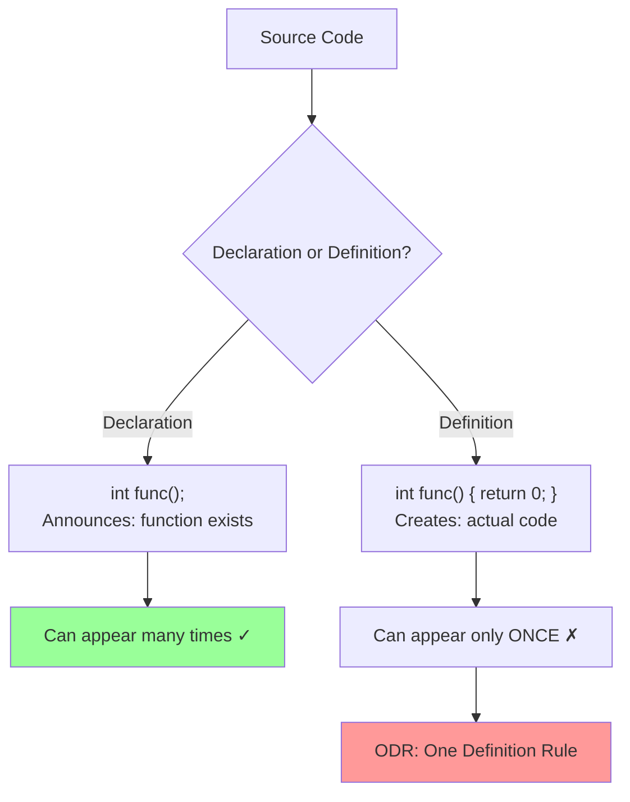

# Definitions and ODR

## [Definitions and ODR](https://en.cppreference.com/w/cpp/language/definition.html)

**Code-related Keywords:**
- Declaration: `int func();` - Announces existence
- Definition: `int func() { return 0; }` - Provides implementation
- `extern` - Declare without defining ([linkage](../../05_declarations/storage_and_linkage.md))
- `inline` - Allow multiple definitions ([specifier](../../05_declarations/specifiers_and_qualifiers.md))

**Theory Keywords:**
- **declaration** - Tells compiler "this thing exists" (announcement only)
- **definition** - Actually creates the thing (provides the full details/code)
- **ODR (One Definition Rule)** - You can define something only once in your entire program
- **multiple declarations** - You can announce the same thing many times (but define only once)
- **linkage** - How different parts of your code find and share the same thing



**Example:**
```cpp
// header.h
int func();                    // Declaration only (no definition)
extern int global_var;         // Declaration: variable exists elsewhere
inline int inlineFunc() {      // inline: can define in header (ODR exception)
    return 42;
}

// source1.cpp
#include "header.h"
int func() { return 1; }       // Definition 1 (OK: only one definition)
int global_var = 100;          // Definition of global_var

// source2.cpp
#include "header.h"
void other() {
    int x = func();            // Declaration from header, definition in source1.cpp
    int y = global_var;        // Uses definition from source1.cpp
    int z = inlineFunc();      // OK: inline allows multiple definitions
}

// Multiple declarations OK
int func();                    // Declaration 1
int func();                    // Declaration 2 (OK: same entity)
// int func() { return 1; }    // Definition 1
// int func() { return 2; }    // ERROR: ODR violation (multiple definitions)
```
