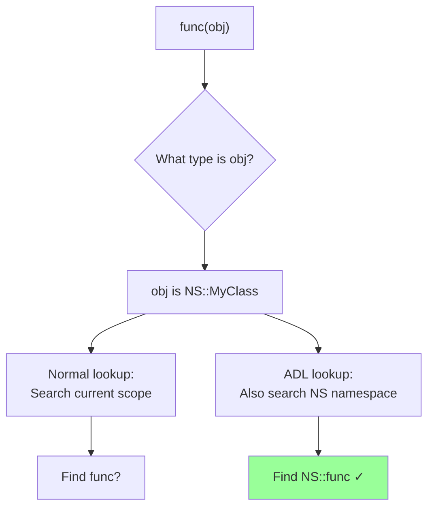

# Name lookup

## Name lookup

**Code-related Keywords:**
- `::` - Scope resolution [operator](../../04_expressions/operators.md)
- [Namespace](../../05_declarations/namespaces.md): `std::cout`
- Qualified: `MyClass::member`
- Unqualified: `func()`

**Theory Keywords:**
- **name lookup** - How compiler finds what a name means (which variable, function, etc.)
- **qualified lookup** - Name has `::` in it, so you told compiler exactly where to look
- **unqualified lookup** - Plain name, compiler searches scopes to find it
- **overload resolution** - When multiple [functions](../../07_functions/function_resolution_and_overloading.md) have same name, picking the right one

**Example:**
```cpp
#include <iostream>

int value = 10;                // Global

namespace NS {
    int value = 20;            // Namespace scope
    void func() {
        int value = 30;        // Local scope
        std::cout << value;    // 30: unqualified (finds local first)
        std::cout << NS::value; // 20: qualified (explicit namespace)
        std::cout << ::value;  // 10: qualified (explicit global)
    }
}
```

### [Qualified name lookup](https://en.cppreference.com/w/cpp/language/qualified_lookup.html)

**Code-related Keywords:**
- `::name` - Global scope
- `namespace::name` - Namespace member
- `class::member` - [Class](../../09_classes/classes.md) member

**Theory Keywords:**
- **qualified name** - Name preceded by `::`
- **scope specification** - Explicitly states which scope to search

**Example:**
```cpp
int x = 1;                     // Global

namespace NS {
    int x = 2;
    class MyClass {
        static int x;
    };
}

int NS::MyClass::x = 3;        // Definition of class static member

int main() {
    int x = 4;                 // Local
    std::cout << x;            // 4: local x
    std::cout << ::x;          // 1: global x (qualified)
    std::cout << NS::x;        // 2: namespace x (qualified)
    std::cout << NS::MyClass::x; // 3: class static x (qualified)
}
```

### [Unqualified name lookup](https://en.cppreference.com/w/cpp/language/unqualified_lookup.html)

**Code-related Keywords:**
- `func()` - Function call without `::`
- `variable` - Variable access without `::`

**Theory Keywords:**
- **search order** - Compiler looks from innermost scope outward: Local → enclosing → namespace → global
- **shadowing** - A name in an inner scope hides (shadows) the same name in outer scopes

**Example:**
```cpp
int value = 1;                 // Global

namespace NS {
    int value = 2;             // Namespace
    
    void func() {
        int value = 3;         // Local
        std::cout << value;    // 3: finds local first (shadows outer scopes)
    }
}

int main() {
    int value = 4;
    std::cout << value;        // 4: local shadows global
    {
        int value = 5;
        std::cout << value;    // 5: inner block shadows outer
    }
    std::cout << value;        // 4: back to main's local
}
```

#### [Argument-dependent lookup (ADL)](https://en.cppreference.com/w/cpp/language/adl.html)

**Code-related Keywords:**
- Function calls: `func(obj)` where obj's type determines namespace
- Works with: [operators](../../04_expressions/operators.md), functions

**Theory Keywords:**
- **ADL (Koenig lookup)** - Compiler also searches the namespace where your argument's type is defined
- **use case** - Why `std::cout << x` works without writing `std::` before `<<` operator



**Example:**
```cpp
namespace NS {
    class MyClass {};
    void func(MyClass) { std::cout << "NS::func\n"; }
}

int main() {
    NS::MyClass obj;
    func(obj);                 // ADL: finds NS::func (no NS:: needed!)
                               // Looks in namespace of obj's type (NS)
    
    // This is why std::cout << x works:
    std::string s = "hello";
    std::cout << s;            // ADL finds operator<< in std namespace
                               // because cout and s are std types
}
```
