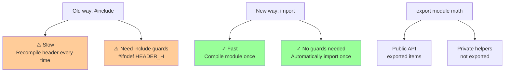

# Modules

## [Modules](https://en.cppreference.com/w/cpp/language/modules.html) (C++20)

**Code-related Keywords:**
- `module` - Declare a module
- `export` - Make entities visible to importers
- `import` - Import a module
- `module :private;` - Mark private module fragment

**Theory Keywords:**
- **module** - Modern replacement for `#include` (C++20) - cleaner and faster
- **module interface** - What others can see (exported stuff)
- **module implementation** - Private code inside the module
- **faster compilation** - Compile module once, reuse it (unlike headers which get recompiled every time)
- **no include guards needed** - Modules automatically imported once (no `#ifndef` needed!)



**Example:**
```cpp
// math.cppm - Module interface unit
export module math;            // Declare module named 'math'

export int add(int a, int b) { // Export function (visible to importers)
    return a + b;
}

int helper() {                 // Not exported (private to module)
    return 42;
}

export int multiply(int a, int b); // Export declaration

module :private;               // Private module fragment

int multiply(int a, int b) {   // Implementation in private fragment
    return a * b;
}

// main.cpp
import math;                   // Import module (replaces #include)
import std;                    // Import standard library modules (C++23)

int main() {
    int sum = add(5, 3);       // OK: add is exported
    int prod = multiply(4, 2); // OK: multiply is exported
    // int x = helper();       // ERROR: helper not exported
}
```

### Module declarations

#### [Module declaration](https://en.cppreference.com/w/cpp/language/modules.html#Module_declarations)

**Code-related Keywords:**
- `export module name;` - Module interface unit
- `module name;` - Module implementation unit

**Example:**
```cpp
// Interface
export module MyModule;        // This is a module interface unit

export void publicFunc();      // Exported declaration

// Implementation
module MyModule;               // Module implementation unit (same module)

void publicFunc() {            // Definition of exported function
    // Implementation
}
```

#### [Primary module interface unit](https://en.cppreference.com/w/cpp/language/modules.html#Module_declarations)

**Theory Keywords:**
- **primary interface** - Main interface file for a module
- **exactly one per module** - Module must have one primary interface

**Example:**
```cpp
// mymodule.cppm - Primary module interface
export module mymodule;        // Primary module interface unit

export class MyClass {         // Export entire class
    int value;
public:
    void setValue(int v);
};

export void freeFunction();    // Export free function
```

#### [Module implementation units](https://en.cppreference.com/w/cpp/language/modules.html#Module_declarations)

**Theory Keywords:**
- **implementation unit** - Contains definitions for module
- **multiple allowed** - Can split implementation across files

**Example:**
```cpp
// mymodule-impl1.cpp
module mymodule;               // Implementation unit for mymodule

void MyClass::setValue(int v) { // Define exported class member
    value = v;
}

// mymodule-impl2.cpp
module mymodule;               // Another implementation unit

void freeFunction() {          // Define exported free function
    // Implementation
}
```

### Exporting and importing

#### [Export declarations](https://en.cppreference.com/w/cpp/language/modules.html#Exporting_declarations_and_definitions)

**Code-related Keywords:**
- `export` - Make entity visible
- `export { }` - Export multiple entities
- `export namespace` - Export entire [namespace](../../05_declarations/namespaces.md)

**Example:**
```cpp
export module utilities;

export int func1();            // Export single declaration

export {                       // Export block (multiple declarations)
    int func2();
    class MyClass {};
    namespace NS {
        void func3();
    }
}

export namespace Math {        // Export entire namespace
    int add(int, int);
    int subtract(int, int);
}
```

#### [Import declarations](https://en.cppreference.com/w/cpp/language/modules.html#Importing_modules_and_header_units)

**Code-related Keywords:**
- `import module_name;` - Import module
- `import :partition;` - Import module partition

**Example:**
```cpp
// Using modules
import std;                    // Import standard library module (C++23)
import math;                   // Import custom module
import mymodule:part1;         // Import partition

int main() {
    std::cout << "Hello\n";    // From std module
    add(1, 2);                 // From math module
}
```

#### [Importing header units](https://en.cppreference.com/w/cpp/language/modules.html#Importing_modules_and_header_units)

**Code-related Keywords:**
- `import <header>;` - Import header as module
- `import "header";` - Import local header as module

**Example:**
```cpp
import <iostream>;             // Import iostream as header unit
import <vector>;
import "myheader.h";           // Import local header as header unit

int main() {
    std::vector<int> v = {1, 2, 3};  // OK: vector imported
    std::cout << v.size() << '\n';   // OK: iostream imported
}
```

### Module fragments

#### [Global module fragment](https://en.cppreference.com/w/cpp/language/modules.html#Global_module_fragment)

**Code-related Keywords:**
- `module;` - Begin global module fragment (before module declaration)
- Legacy header includes go here

**Example:**
```cpp
module;                        // Global module fragment begins
#include <cstdio>              // Include legacy headers here
#include "legacy.h"

export module MyModule;        // Module declaration

export void func() {
    printf("Legacy C function\n");  // Use legacy code
}
```

#### [Private module fragment](https://en.cppreference.com/w/cpp/language/modules.html#Private_module_fragment)

**Code-related Keywords:**
- `module :private;` - Begin private fragment (in interface unit)

**Example:**
```cpp
export module mymodule;

export int publicFunc();       // Public interface

module :private;               // Private module fragment begins

int helper() { return 42; }    // Private helper (not visible to importers)

int publicFunc() {             // Implementation using private code
    return helper();
}
```

### [Module partitions](https://en.cppreference.com/w/cpp/language/modules.html#Module_partitions)

**Code-related Keywords:**
- `export module name:partition;` - Module partition interface
- `module name:partition;` - Module partition implementation
- `export import :partition;` - Re-export partition

**Theory Keywords:**
- **partition** - Split large module into smaller parts
- **internal partitions** - Not visible outside module unless re-exported

**Example:**
```cpp
// mymodule-part1.cppm
export module mymodule:part1;  // Partition interface

export void func1() {}

// mymodule-part2.cppm
export module mymodule:part2;  // Another partition

export void func2() {}

// mymodule.cppm - Primary interface
export module mymodule;

export import :part1;          // Re-export partition 1
export import :part2;          // Re-export partition 2

// main.cpp
import mymodule;               // Imports primary + re-exported partitions

int main() {
    func1();                   // From part1
    func2();                   // From part2
}
```

### [Module ownership](https://en.cppreference.com/w/cpp/language/modules.html#Module_ownership)

**Theory Keywords:**
- **module ownership** - Declarations belong to the module where they first appear
- **no redeclaration** - Cannot declare entity from another module

**Example:**
```cpp
// module1.cppm
export module module1;
export class MyClass {};       // MyClass belongs to module1

// module2.cppm
export module module2;
import module1;

export class MyClass {};       // ERROR: MyClass already owned by module1
export void func(MyClass c);   // OK: use MyClass from module1
```
