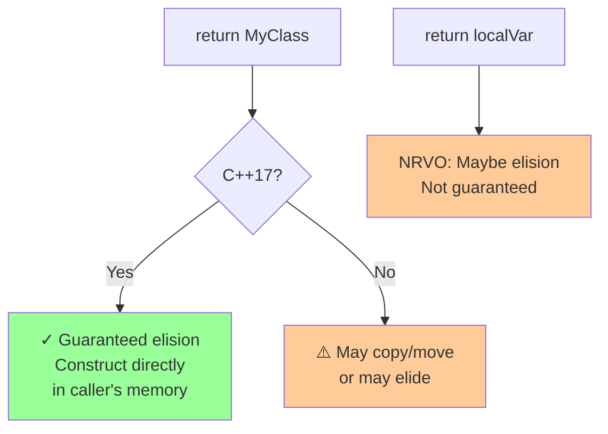

# Conversions

## Conversions

### [Copy elision](https://en.cppreference.com/w/cpp/language/copy_elision.html) (C++17 guaranteed)

**Code-related Keywords:**
- RVO - Return Value Optimization
- NRVO - Named Return Value Optimization
- Prvalue materialization (C++17)

**Theory Keywords:**
- **copy elision** - Compiler optimization that skips making copies (saves time!)
- **guaranteed (C++17)** - When returning temporary objects, no copy is made (compiler must do this)
- **optimization** - No copy/move constructor called even if they exist



**Example:**
```cpp
struct MyClass {
    MyClass() { std::cout << "Construct\n"; }
    MyClass(const MyClass&) { std::cout << "Copy\n"; }
};

MyClass create() {
    return MyClass();          // C++17: NO copy (guaranteed elision)
}                              // Pre-C++17: copy may be elided (optional)

MyClass obj = create();        // C++17: Only one construction (no copy!)
                               // Output: "Construct" (not "Construct Copy")

MyClass named() {
    MyClass local;
    return local;              // NRVO: may be elided (not guaranteed)
}
```

### [Implicit conversions](https://en.cppreference.com/w/cpp/language/implicit_conversion.html)

**Code-related Keywords:**
- Numeric promotion: `char` → `int`
- Numeric conversion: `int` → `double`, `double` → `int`
- Pointer conversion: `Derived*` → `Base*`
- Boolean: any [type](../../02_types_and_objects/types.md) → `bool`

**Theory Keywords:**
- **implicit** - Happens automatically without you asking for it
- **promotion** - Make type bigger (no data lost, e.g., `char` → `int`)
- **narrowing** - Make type smaller (can lose data!, e.g., `double` → `int`). C++11 `{}` won't allow this

```mermaid
graph TD
    A[char c = 'A'] --> B[Promotion to int]
    B --> C[✓ Safe, no data loss<br/>65 fits in int]
    
    D[double d = 3.14] --> E[Narrowing to int]
    E --> F[⚠️ Loses decimal part<br/>becomes 3]
    
    G[int k = 3.14 ] -->|OK but dangerous| F
    H[int k{3.14}] -->|C++11| I[❌ Error!<br/>Prevents accidents]
    
    style C fill:#99ff99
    style F fill:#ff9999
    style I fill:#99ff99
```

**Example:**
```cpp
int i = 42;
double d = i;                  // Implicit: int → double (promotion)
int j = 3.14;                  // Implicit: double → int (narrowing, j = 3)
// int k{3.14};                // ERROR C++11: narrowing in {} not allowed

char c = 'A';
int val = c + 1;               // 'A' promoted to int, then +1 → 66

bool b1 = 42;                  // true: non-zero → true
bool b2 = ptr;                 // true if ptr != nullptr

struct Base {};
struct Derived : Base {};
Derived d_obj;
Base* b_ptr = &d_obj;          // Implicit: Derived* → Base* (upcasting)
```

### [const_cast](https://en.cppreference.com/w/cpp/language/const_cast.html)

**Code-related Keywords:**
- `const_cast<T>(expr)` - Add/remove `const` or `volatile`

**Theory Keywords:**
- **const correctness** - Only cast when interfacing with legacy code
- **undefined behavior** - Modifying actually-const object

**Example:**
```cpp
void legacy_func(int* p);      // Legacy function: should be const but isn't

void modern_func(const int* p) {
    legacy_func(const_cast<int*>(p));  // Remove const to call legacy code
}                              // Safe only if legacy_func doesn't modify!

const int x = 42;
int* px = const_cast<int*>(&x); // Remove const
*px = 10;                      // UNDEFINED BEHAVIOR: x was originally const!

int y = 42;
const int* cy = &y;
int* py = const_cast<int*>(cy); // OK: y wasn't originally const
*py = 10;                      // OK: y can be modified
```

### [static_cast](https://en.cppreference.com/w/cpp/language/static_cast.html)

**Code-related Keywords:**
- `static_cast<T>(expr)` - Explicit conversion (compile-time check)
- Use for: numeric conversions, upcasting, reversing implicit conversions

**Theory Keywords:**
- **compile-time** - No runtime overhead
- **safe casts** - Compiler checks validity

**Example:**
```cpp
double d = 3.14;
int i = static_cast<int>(d);   // 3: explicit narrowing conversion

float f = 2.5f;
int j = static_cast<int>(f);   // 2: float → int

void* ptr = malloc(sizeof(int));
int* iptr = static_cast<int*>(ptr);  // void* → int*

struct Base { virtual ~Base() {} };
struct Derived : Base {};
Base* b = new Derived();
Derived* d_ptr = static_cast<Derived*>(b);  // Downcast (use dynamic_cast for safety!)
```

### [dynamic_cast](https://en.cppreference.com/w/cpp/language/dynamic_cast.html)

**Code-related Keywords:**
- `dynamic_cast<T>(expr)` - Runtime type-safe downcast
- Requires RTTI (Runtime Type Information)
- Returns `nullptr` on failure (pointers) or throws `std::bad_cast` (references)

**Theory Keywords:**
- **runtime check** - Verifies cast is valid
- **polymorphic types** - Requires virtual functions
- **safe downcast** - Returns null if wrong type

**Example:**
```cpp
struct Base { virtual ~Base() {} };  // Must have virtual function
struct Derived : Base { void f() {} };

Base* b = new Derived();
Derived* d = dynamic_cast<Derived*>(b);  // OK: actually Derived, d != nullptr
if (d) {                       // Always check result!
    d->f();                    // Safe to call Derived methods
}

Base* b2 = new Base();
Derived* d2 = dynamic_cast<Derived*>(b2);  // Fails: b2 not actually Derived
// d2 == nullptr

Base& br = *b;
Derived& dr = dynamic_cast<Derived&>(br);  // Throws std::bad_cast on failure
```

### [reinterpret_cast](https://en.cppreference.com/w/cpp/language/reinterpret_cast.html)

**Code-related Keywords:**
- `reinterpret_cast<T>(expr)` - Low-level reinterpretation of bits
- Use for: pointer ↔ integer, unrelated pointer types

**Theory Keywords:**
- **dangerous** - No safety checks, easy to cause undefined behavior
- **bit pattern** - Treats memory as different type

**Example:**
```cpp
int i = 42;
void* vptr = reinterpret_cast<void*>(&i);  // int* → void*
int* iptr = reinterpret_cast<int*>(vptr);  // void* → int*

uintptr_t addr = reinterpret_cast<uintptr_t>(&i);  // Pointer → integer

struct A { int x; };
struct B { int y; };           // Unrelated to A
A a;
B* b = reinterpret_cast<B*>(&a);  // DANGEROUS: treat A as B (undefined behavior!)
```

### [C-style cast](https://en.cppreference.com/w/cpp/language/explicit_cast.html)

**Code-related Keywords:**
- `(type)expr` - C-style cast (tries multiple casts)
- C++ style: `type(expr)`

**Theory Keywords:**
- **avoid in C++** - Hides what cast actually does
- **precedence** - Tries const_cast, static_cast, then reinterpret_cast

**Example:**
```cpp
double d = 3.14;
int i = (int)d;                // C-style cast (avoid in C++)
int j = int(d);                // Function-style cast (also avoid)

// Use explicit C++ casts instead:
int k = static_cast<int>(d);   // Clear intent: numeric conversion

// C-style is dangerous - can do unexpected things:
const int* cp = &i;
int* p = (int*)cp;             // const_cast (hidden!)
```

### [User-defined conversion](https://en.cppreference.com/w/cpp/language/cast_operator.html)

**Code-related Keywords:**
- `operator T()` - Conversion operator
- `explicit` - Prevent implicit conversion ([specifier](../../09_classes/conversion_functions.md))
- Converting [constructor](../../09_classes/special_member_functions.md) - Single-argument constructor

**Example:**
```cpp
struct MyInt {
    int value;
    
    MyInt(int v) : value(v) {}  // Converting constructor: int → MyInt
    
    operator int() const {     // Conversion operator: MyInt → int
        return value;
    }
    
    explicit operator bool() const {  // Explicit: requires static_cast<bool>
        return value != 0;
    }
};

MyInt mi = 42;                 // Implicit: int → MyInt (converting constructor)
int i = mi;                    // Implicit: MyInt → int (conversion operator)
bool b = static_cast<bool>(mi); // Explicit conversion required
// bool b2 = mi;               // ERROR: explicit conversion
```
