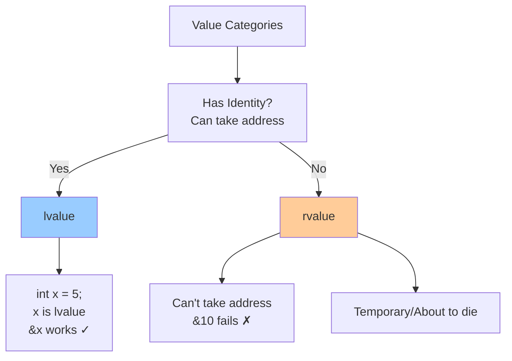

# Expressions

## [Expressions](https://en.cppreference.com/w/cpp/language/expressions.html)

**Code-related Keywords:**
- Expression: `2 + 3`, `x = 5`, `func()`, `a > b`
- Operators: `+`, `-`, `*`, `/`, `=`, `==`, `<`, `>`
- Operands: Variables, [literals](./literals.md), function calls

**Theory Keywords:**
- **expression** - Sequence of operators and operands that computes a value
- **side effect** - Expression that modifies state (assignment, I/O, etc.)

**Example:**
```cpp
int x = 5;                     // Expression: 5 (value), side effect: assigns to x
int y = 2 + 3;                 // Expression: 2 + 3 evaluates to 5
int z = x++;                   // Expression: x (before increment), side effect: x becomes 6
bool b = (x > y);              // Expression: comparison result (true/false)
func();                        // Expression: function call (may have side effects)
x = y = z = 0;                 // Multiple assignments: right-to-left associativity
```

### [Value categories](https://en.cppreference.com/w/cpp/language/value_category.html)

**Code-related Keywords:**
- `lvalue` - Named variable (has a location, can take its address with `&`)
- `rvalue` - Temporary value (like `5` or `x + y`, can't take its address)
- `xvalue` - "Expiring" value (result of `std::move`, about to be destroyed)
- `prvalue` - "Pure" rvalue (literal like `42`, or function returning by value)
- `glvalue` - Generalized lvalue (either lvalue or xvalue - anything with identity)

**Theory Keywords:**
- **identity** - The value lives somewhere in memory (you can find its address)
- **movable** - You can transfer ownership of the value (not just copy it)



**Example:**
```cpp
int x = 10;                    // x is lvalue (has address, persists)
int* ptr = &x;                 // OK: can take address of lvalue
// int* p = &10;               // ERROR: cannot take address of rvalue (10 is prvalue)

int&& rref = 20;               // rvalue reference binds to prvalue (20)
int&& rref2 = std::move(x);    // std::move converts lvalue to xvalue

func();                        // prvalue if func returns by value
int& getRef();                 
getRef();                      // lvalue (returns reference)

x + y;                         // prvalue: temporary result
++x;                           // lvalue: returns reference to x
x++;                           // prvalue: returns temporary (old value)
```

### [Evaluation order](https://en.cppreference.com/w/cpp/language/eval_order.html)

**Code-related Keywords:**
- Sequence points: `;`, `&&`, `||`, `,`, `?:`
- Unsequenced: Order not guaranteed

**Theory Keywords:**
- **evaluation order** - Order in which expressions are computed
- **undefined behavior** - Multiple writes to same variable in single expression
- **sequence points** - Guarantees all previous evaluations complete

**Example:**
```cpp
int i = 0;
i = i++ + ++i;                 // UNDEFINED BEHAVIOR: multiple modifications
                               // Don't modify variable twice without sequence point!

int x = f() + g();             // Order of f() and g() unspecified (before C++17)
                               // C++17: left-to-right for operators

func(a++, a++);                // UNDEFINED: modifies 'a' twice in unsequenced calls
func(a++, b++);                // OK: different variables

if (ptr && ptr->value) {}      // OK: && guarantees left before right (short-circuit)
int x = a(), b();              // Comma operator: a() before b(), result is b()
```

### [Constant expressions](https://en.cppreference.com/w/cpp/language/constant_expression.html)

**Code-related Keywords:**
- `constexpr` - Evaluated at compile time ([specifier](../../05_declarations/specifiers_and_qualifiers.md))
- `const` - Immutable after [initialization](../../06_initialization/initialization.md)
- Compile-time: Array sizes, template arguments, case labels

**Theory Keywords:**
- **constant expression** - Expression evaluated at compile time
- **compile-time evaluation** - No runtime cost

**Example:**
```cpp
const int x = 5;               // Const: value cannot change (may be runtime)
constexpr int y = 10;          // constexpr: MUST be compile-time constant

int arr[y];                    // OK: y is compile-time constant
// int arr2[x];                // May error: x might not be compile-time constant

constexpr int square(int n) {  // constexpr function: can run at compile-time
    return n * n;
}

constexpr int val = square(5); // Evaluated at compile-time: val = 25
int runtime = square(x);       // May run at runtime if x not constexpr

enum { SIZE = y };             // OK: enum needs compile-time constant
```
