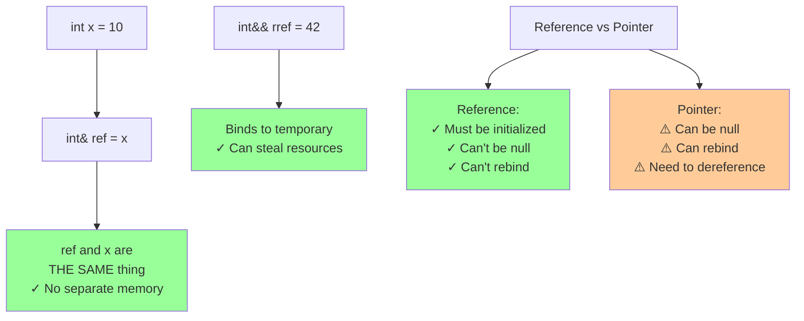
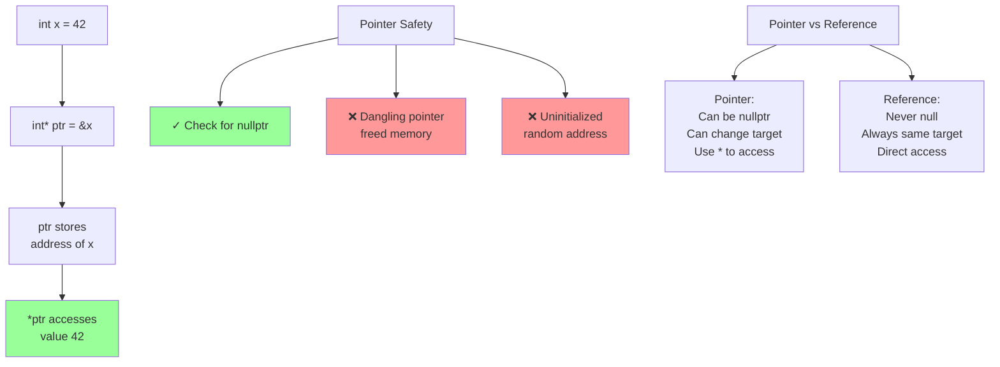

# Compound types

## Compound types

### [References](https://en.cppreference.com/w/cpp/language/reference.html)

**Code-related Keywords:**
- `T&` - Lvalue reference
- `T&&` - Rvalue reference (C++11)
- `const T&` - Const lvalue reference
- Must be initialized, cannot be reseated

**Theory Keywords:**
- **reference** - Another name for the same object (like a nickname)
- **lvalue reference** - Name for existing objects (`int& ref = x`)
- **rvalue reference** - Name for temporary/movable objects (`int&& rref = getTmp()`)
- **no null references** - References always point to something valid (unlike pointers!)



**Example:**
```cpp
int x = 10;
int& ref = x;                  // Lvalue reference (alias for x)
ref = 20;                      // Modifies x through reference (x = 20)

const int& cref = x;           // Const reference (cannot modify through cref)
// cref = 30;                  // ERROR: cannot modify const reference

// int& bad;                   // ERROR: must initialize reference
// int& bad2 = nullptr;        // ERROR: no null references

// Rvalue references (C++11):
int&& rref = 42;               // Binds to temporary (rvalue)
// int&& bad3 = x;             // ERROR: cannot bind rvalue ref to lvalue
int&& rref2 = std::move(x);    // std::move converts lvalue to rvalue

// References in functions:
void modify(int& r) { r++; }   // Pass by reference (can modify)
void read(const int& r) {}     // Const reference (efficient, no copy, no modify)
```

### [Pointers](https://en.cppreference.com/w/cpp/language/pointer.html)

**Code-related Keywords:**
- `T*` - Pointer to T
- `&` - Address-of [operator](../../04_expressions/operators.md)
- `*` - Dereference operator
- `->` - Member access through pointer
- `nullptr` - Null pointer [literal](../../04_expressions/literals.md) (C++11)
- `void*` - Generic pointer

**Theory Keywords:**
- **pointer** - Variable that holds a memory address (like a street address)
- **null pointer** - Special value meaning "points to nothing" (use `nullptr`)
- **dangling pointer** - DANGEROUS! Points to memory that was freed (causes crashes!)
- **pointer arithmetic** - Move pointer forward/backward in memory (like array indexing)



**Example:**
```cpp
int x = 42;
int* ptr = &x;                 // Pointer to x (stores x's address)
*ptr = 50;                     // Dereference: modify x through pointer (x = 50)

int* null = nullptr;           // C++11: null pointer (preferred over NULL)
if (ptr != nullptr) {          // Always check before dereferencing!
    *ptr = 60;
}

int arr[5] = {1,2,3,4,5};
int* p = arr;                  // Array name decays to pointer
p++;                           // Pointer arithmetic: points to arr[1]
int val = *p;                  // val = 2

struct Point { int x, y; };
Point pt = {1, 2};
Point* ppt = &pt;
ppt->x = 10;                   // Arrow operator: (*ppt).x = 10

void* generic = &x;            // void*: type-erased pointer
// *generic;                   // ERROR: cannot dereference void*
int* typed = static_cast<int*>(generic);  // Cast back to use
```

### [Arrays](https://en.cppreference.com/w/cpp/language/array.html)

**Code-related Keywords:**
- `T arr[N]` - Array of N elements
- `T arr[] = {values}` - Array with inferred size
- `arr[i]` - Subscript operator
- `std::array<T, N>` - C++11: safer alternative

**Theory Keywords:**
- **fixed size** - Size determined at compile time
- **contiguous memory** - Elements stored sequentially
- **no bounds checking** - Accessing out-of-bounds is undefined behavior
- **array decay** - Array name converts to pointer in most contexts

**Example:**
```cpp
int arr[5];                    // Array of 5 ints (uninitialized)
int arr2[5] = {1, 2, 3};       // Partial init: {1, 2, 3, 0, 0}
int arr3[] = {1, 2, 3, 4};     // Size inferred: 4 elements

int val = arr3[0];             // Access first element (val = 1)
arr3[2] = 10;                  // Modify third element
// arr3[10] = 5;               // UNDEFINED BEHAVIOR: out of bounds!

int size = sizeof(arr3) / sizeof(arr3[0]);  // Calculate array size: 4

int* ptr = arr3;               // Array decays to pointer (points to first element)

// Multidimensional:
int matrix[3][4];              // 3 rows, 4 columns
matrix[1][2] = 5;              // Access row 1, column 2

// C++11: std::array (safer, knows its size)
#include <array>
std::array<int, 5> sarr = {1,2,3,4,5};
int s = sarr.size();           // 5: knows size
// sarr.at(10);                // Throws exception if out of bounds
```
