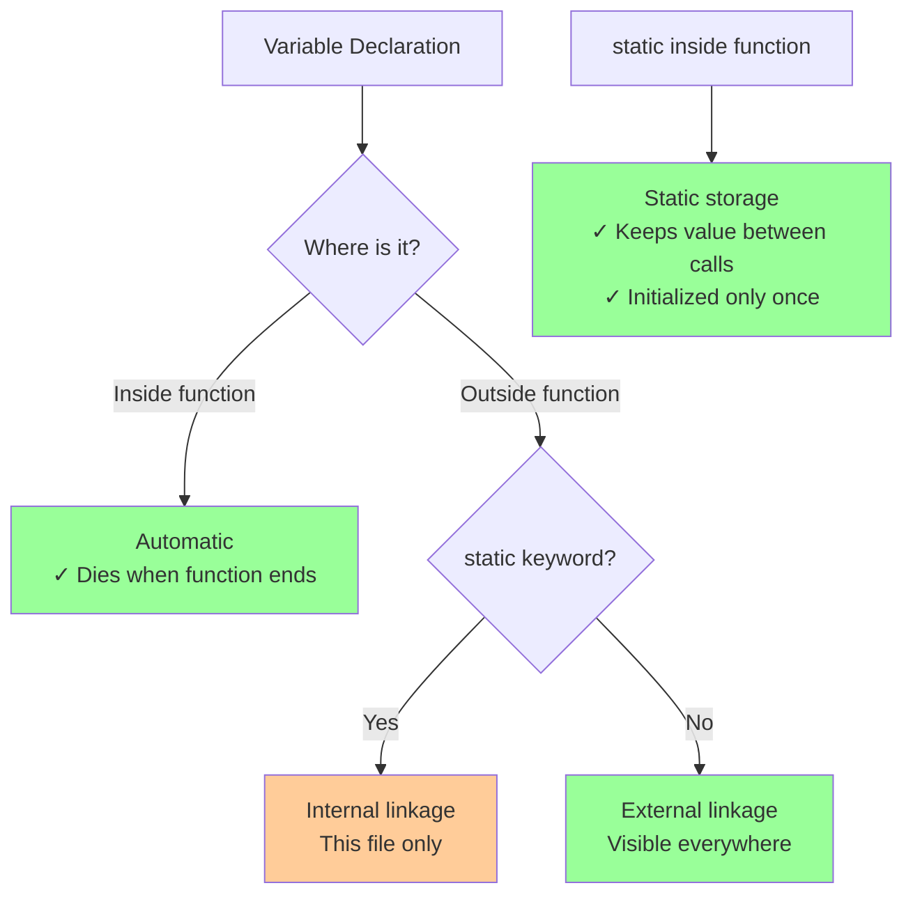

# Storage and linkage

## Storage and linkage

### [Storage duration and linkage](https://en.cppreference.com/w/cpp/language/storage_duration.html)

**Code-related Keywords:**
- `auto` - Automatic storage (local variables, default)
- `static` - Static storage duration
- `extern` - External linkage
- `thread_local` - Thread storage (C++11)

**Theory Keywords:**
- **automatic** - Lives only inside its block/function (dies when function returns)
- **static** - Lives for entire program (never dies until program ends)
- **external linkage** - Other files can see and use it
- **internal linkage** - Only visible in this one file
- **no linkage** - Only visible in current scope (like local variables)



**Example:**
```cpp
int global = 1;                // Static storage, external linkage
static int file_local = 2;     // Static storage, internal linkage (file-scope only)
extern int external_var;       // Declaration: defined elsewhere

void func() {
    int local = 3;             // Automatic storage (created/destroyed each call)
    static int persistent = 4; // Static storage: initialized once, persists across calls
    
    local++;                   // Reset each call
    persistent++;              // Keeps incrementing across calls
}

thread_local int tls = 5;      // C++11: one instance per thread
```

### [Translation-unit-local](https://en.cppreference.com/w/cpp/language/tu_local.html) (C++20)

**Theory Keywords:**
- **translation-unit-local** - Entity visible only in current TU (C++20)
- **module linkage** - Entities local to module

**Example:**
```cpp
// C++20: unnamed namespace or static gives TU-local linkage
namespace {
    int hidden = 10;           // Translation-unit-local (like static)
}

static int also_hidden = 20;   // Translation-unit-local

// In modules (C++20):
module;
export module MyModule;
static int module_local = 30;  // Local to this module
```

### [Language linkage](https://en.cppreference.com/w/cpp/language/language_linkage.html)

**Code-related Keywords:**
- `extern "C"` - C language linkage (no name mangling)
- `extern "C++"` - C++ language linkage (default, name mangling)

**Theory Keywords:**
- **name mangling** - Encoding type info in symbol names (C++)
- **C linkage** - No mangling, for compatibility with C

**Example:**
```cpp
// Declare C functions (from C library or C code):
extern "C" {
    void c_function();         // No name mangling
    int c_api(int x);
}

extern "C" void single_func(); // Single declaration

// C++ function (name mangled):
void cpp_func();               // Mangled: _Z8cpp_funcv

// Useful for creating C-compatible APIs:
extern "C" {
    void my_api_init();        // Can be called from C code
}
```
