# Initialization

## [Initialization](https://en.cppreference.com/w/cpp/language/initialization.html)

**Code-related Keywords:**
- `T obj = value;` - Copy initialization
- `T obj(value);` - Direct initialization
- `T obj{value};` - List initialization (C++11)
- `T obj{};` - Value initialization
- `T obj;` - Default initialization
- `new T()` - Dynamic value initialization

**Theory Keywords:**
- **initialization vs assignment** - Initialization = giving first value when created; Assignment = changing value later
- **uniform initialization** - Using `{}` braces works for all types (C++11 made this consistent)
- **narrowing prevention** - List initialization `{}` stops you from losing data in conversions
- **most vexing parse** - A confusing case where `Thing obj()` looks like creating an object but is actually declaring a function!

```mermaid
graph TD
    A[Creating a variable] --> B{How to initialize?}
    B -->|"T obj;"| C[Default<br/>May be garbage!]
    B -->|"T obj = value;"| D[Copy]
    B -->|"T obj(value);"| E[Direct]
    B -->|"T obj{value};"| F[List Modern ✓]
    
    F --> G[Prevents mistakes:<br/>No narrowing<br/>No vexing parse]
    
    style F fill:#99ff99
    style C fill:#ff9999
```



**Example:**
```cpp
// Default initialization (uninitialized for built-ins):
int a;                    // Indeterminate value (dangerous!)

// Value initialization (zero for built-ins):
int b{};                  // 0
int c = int();            // 0

// Copy initialization:
int d = 42;               // Copy
std::string s1 = "hello"; // Implicit conversion

// Direct initialization:
int e(42);                // Direct
std::string s2("hello");

// List initialization (C++11, preferred):
int f{42};                // Uniform syntax
std::vector<int> v{1, 2, 3};  // Initializer list
std::string s3{"hello"};

// Narrowing prevention:
int x = 1000;
// char c{x};             // ERROR: narrowing (int to char)
char c{100};              // OK: literal fits

// Most vexing parse:
std::string s4();         // Function declaration (not object!)
std::string s5{};         // Object (C++11 solves this)

// Dynamic:
int* p = new int(42);     // Direct init
int* q = new int{42};     // List init
```
