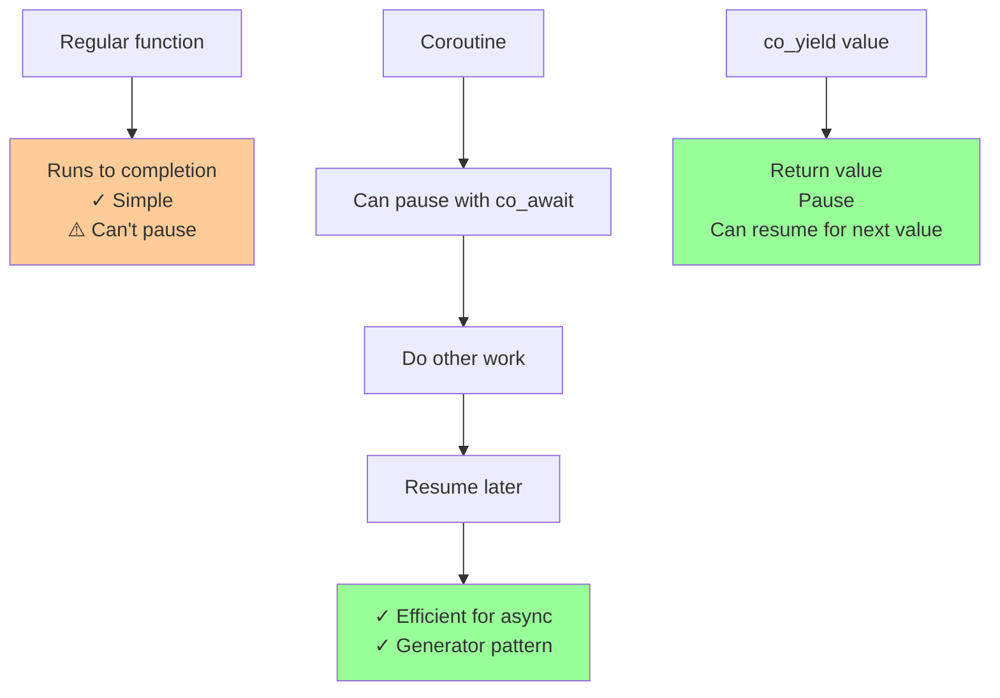

# Advanced function types

## Advanced function types

### [Coroutines](https://en.cppreference.com/w/cpp/language/coroutines.html) (C++20)

**Code-related Keywords:**
- `co_await` - Suspend execution (C++20)
- `co_yield` - Return value and suspend (C++20)
- `co_return` - Complete coroutine (C++20)
- `std::coroutine_handle` - Manage coroutine state
- `promise_type` - Customize coroutine behavior

**Theory Keywords:**
- **suspension point** - Function can pause and resume later (like hitting pause/play)
- **lazy evaluation** - Only compute values when you need them (not all at once)
- **generator** - Function that can return multiple values one at a time (like a vending machine)
- **async task** - Function that can wait for something without blocking everything



**Example:**
```cpp
#include <coroutine>
#include <iostream>

// Simple generator:
struct Generator {
    struct promise_type {
        int current_value;
        
        Generator get_return_object() {
            return Generator{std::coroutine_handle<promise_type>::from_promise(*this)};
        }
        std::suspend_always initial_suspend() { return {}; }
        std::suspend_always final_suspend() noexcept { return {}; }
        void unhandled_exception() { }
        
        std::suspend_always yield_value(int value) {
            current_value = value;
            return {};
        }
    };
    
    std::coroutine_handle<promise_type> coro;
    
    ~Generator() { if (coro) coro.destroy(); }
    
    int value() { return coro.promise().current_value; }
    bool next() { coro.resume(); return !coro.done(); }
};

Generator counter() {
    for (int i = 0; i < 3; ++i) {
        co_yield i;           // Yield value and suspend
    }
}

// Usage:
auto gen = counter();
while (gen.next()) {
    std::cout << gen.value() << '\n';  // Prints: 0, 1, 2
}
```

### [Replacement functions](https://en.cppreference.com/w/cpp/language/replacement_function.html)

**Code-related Keywords:**
- `operator new` - Custom memory allocation
- `operator delete` - Custom deallocation
- Global replacement - Override default new/delete

**Theory Keywords:**
- **custom allocator** - Replace standard memory management
- **memory tracking** - Monitor allocations/deallocations
- **program-wide effect** - Affects all new/delete in program

**Example:**
```cpp
#include <cstdlib>
#include <iostream>

// Track allocation count:
int allocCount = 0;

// Replace global operator new:
void* operator new(std::size_t size) {
    ++allocCount;
    std::cout << "Allocating " << size << " bytes\n";
    void* p = std::malloc(size);
    if (!p) throw std::bad_alloc();
    return p;
}

// Replace global operator delete:
void operator delete(void* ptr) noexcept {
    std::cout << "Deallocating\n";
    std::free(ptr);
}

// Usage:
int* p = new int(42);     // Calls custom operator new
delete p;                 // Calls custom operator delete

std::cout << "Total allocations: " << allocCount << '\n';
```
