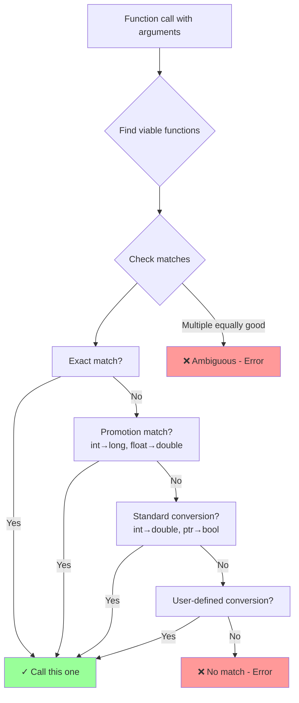

# Function resolution and overloading

## Function resolution and overloading

### [Overload resolution](https://en.cppreference.com/w/cpp/language/overload_resolution.html)

**Code-related Keywords:**
- Function overloading - Same name, different parameters
- `const` overloading - Different const-qualification
- Best match - Compiler selects most specific overload

**Theory Keywords:**
- **viable functions** - Functions the compiler can actually call with your arguments
- **exact match** - No conversion needed (compiler prefers this)
- **ambiguity** - Error when compiler can't decide which function to call
- **overload resolution rules** - Preference order: exact match → promotion (int to long) → standard conversion (int to double) → user-defined conversion



**Example:**
```cpp
// Parameter count overloading:
void print(int x) { std::cout << "int: " << x << '\n'; }
void print(int x, int y) { std::cout << "two ints: " << x << ", " << y << '\n'; }

print(5);                 // Calls print(int)
print(5, 10);             // Calls print(int, int)

// Type overloading:
void process(int x) { std::cout << "int\n"; }
void process(double x) { std::cout << "double\n"; }

process(42);              // Exact match: int
process(3.14);            // Exact match: double
// process(42L);          // Ambiguous: long converts equally to int/double

// const overloading:
void func(int& x) { std::cout << "non-const\n"; }
void func(const int& x) { std::cout << "const\n"; }

int a = 10;
func(a);                  // non-const version
func(5);                  // const version (temporary is const)

// Reference qualifiers (C++11):
struct Foo {
    void bar() & { std::cout << "lvalue\n"; }   // Called on lvalue
    void bar() && { std::cout << "rvalue\n"; }  // Called on rvalue
};

Foo f;
f.bar();                  // lvalue
Foo().bar();              // rvalue
```

### [Operator overloading](https://en.cppreference.com/w/cpp/language/operators.html)

**Code-related Keywords:**
- `operator+`, `operator-`, etc. - Overload [operators](../../04_expressions/operators.md)
- Member vs non-member - `T::operator+()` vs `operator+(T, T)`
- `friend` - Grant non-member access to private members
- Special operators - `operator[]`, `operator()`, `operator->`, `operator=`

**Theory Keywords:**
- **symmetric operations** - Non-member for commutativity (e.g., `a+b` and `b+a`)
- **stream operators** - `operator<<`, `operator>>` for I/O
- **assignment operator** - `operator=` typically member function

**Example:**
```cpp
class Complex {
    double real, imag;
public:
    Complex(double r = 0, double i = 0) : real(r), imag(i) {}
    
    // Member operator:
    Complex operator+(const Complex& other) const {
        return Complex(real + other.real, imag + other.imag);
    }
    
    // Comparison:
    bool operator==(const Complex& other) const {
        return real == other.real && imag == other.imag;
    }
    
    // Compound assignment:
    Complex& operator+=(const Complex& other) {
        real += other.real;
        imag += other.imag;
        return *this;
    }
    
    // Friend for stream output:
    friend std::ostream& operator<<(std::ostream& os, const Complex& c) {
        return os << c.real << " + " << c.imag << "i";
    }
};

Complex a(1, 2), b(3, 4);
Complex c = a + b;        // operator+: (4, 6)
std::cout << c;           // operator<<: "4 + 6i"

// Function call operator:
struct Multiplier {
    int operator()(int x, int y) const { return x * y; }
};
Multiplier mult;
int result = mult(3, 4);  // 12 (acts like function)
```

### [Address of an overload set](https://en.cppreference.com/w/cpp/language/overloaded_address.html)

**Code-related Keywords:**
- `&funcName` - Address of function
- [Type](../../02_types_and_objects/types.md) disambiguation - Specify which overload
- Function [pointer](../../05_declarations/compound_types.md) - Store function address

**Theory Keywords:**
- **overload resolution** - Context determines which overload
- **explicit cast** - Disambiguate overload set

**Example:**
```cpp
// Overload set:
void func(int x) { std::cout << "int: " << x << '\n'; }
void func(double x) { std::cout << "double: " << x << '\n'; }

// Context determines overload:
void (*ptr1)(int) = &func;     // Selects func(int)
void (*ptr2)(double) = &func;  // Selects func(double)

ptr1(42);                 // "int: 42"
ptr2(3.14);               // "double: 3.14"

// Explicit cast:
auto p = static_cast<void(*)(int)>(&func);  // Explicitly select func(int)
p(10);                    // "int: 10"

// With templates:
template<typename T>
void process(T x) { std::cout << x << '\n'; }

void (*pInt)(int) = &process;  // Instantiates process<int>
pInt(100);                // "100"
```
