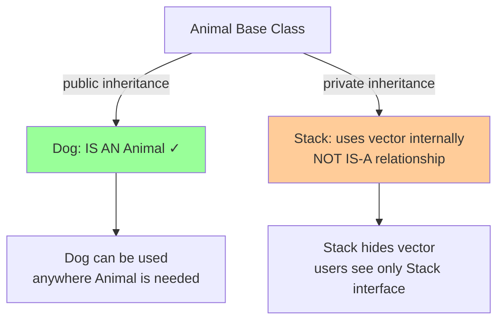
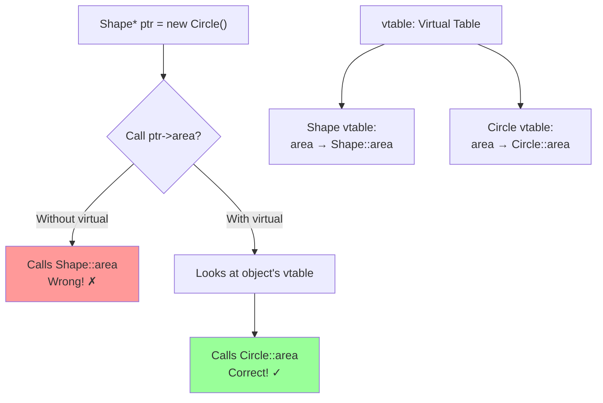

# Inheritance and derived classes

## Inheritance and derived classes

### [Derived class](https://en.cppreference.com/w/cpp/language/derived_class.html)

**Code-related Keywords:**
- `class Derived : public Base { };` - Public inheritance
- `class Derived : protected Base { };` - Protected inheritance
- `class Derived : private Base { };` - Private inheritance (default for class)
- Base class constructor - Called first

**Theory Keywords:**
- **is-a relationship** - Derived class IS A type of Base class (Dog is an Animal)
- **inheritance modes** - public (true "is-a"), protected/private (just borrowing code internally)
- **construction order** - Base class constructor runs first, then derived class



**Example:**
```cpp
// Base class:
class Animal {
protected:
    std::string name;
    
public:
    Animal(std::string n) : name(n) {}
    
    void eat() { std::cout << name << " eats\n"; }
};

// Derived class (public inheritance):
class Dog : public Animal {
    std::string breed;
    
public:
    Dog(std::string n, std::string b) 
        : Animal(n), breed(b) {}  // Call base constructor
    
    void bark() { std::cout << name << " barks\n"; }
};

Dog d("Buddy", "Labrador");
d.eat();                  // Inherited from Animal
d.bark();                 // Dog's own method

// Private inheritance (implementation detail):
class Stack : private std::vector<int> {  // Implementation inheritance
public:
    void push(int x) { push_back(x); }     // Expose selected methods
    void pop() { pop_back(); }
    int top() const { return back(); }
    // vector methods hidden from users
};
```

### [using-declaration](https://en.cppreference.com/w/cpp/language/using_declaration.html)

**Code-related Keywords:**
- `using Base::member;` - Unhide base member
- Overload resolution - Bring base overloads into scope

**Theory Keywords:**
- **name hiding** - Derived hides all base overloads
- **using brings back** - Make base overloads visible

**Example:**
```cpp
class Base {
public:
    void func(int x) { std::cout << "Base::func(int)\n"; }
    void func(double x) { std::cout << "Base::func(double)\n"; }
};

class Derived : public Base {
public:
    void func(std::string s) { std::cout << "Derived::func(string)\n"; }
    
    // Without using, Base::func overloads hidden:
    // using Base::func;     // Uncomment to unhide
};

Derived d;
d.func("hi");             // OK: Derived::func(string)
// d.func(42);            // ERROR: Base::func hidden
// d.func(3.14);          // ERROR: Base::func hidden

// With using:
class DerivedFixed : public Base {
public:
    using Base::func;     // Bring base overloads into scope
    void func(std::string s) { std::cout << "DerivedFixed::func(string)\n"; }
};

DerivedFixed df;
df.func("hi");            // Derived::func(string)
df.func(42);              // Base::func(int) - now visible
df.func(3.14);            // Base::func(double) - now visible
```

### [Empty base optimization (EBO)](https://en.cppreference.com/w/cpp/language/ebo.html)

**Code-related Keywords:**
- Empty base - No non-static data members
- No size overhead - Compiler optimizes away

**Theory Keywords:**
- **zero-size base** - Empty base takes no space
- **stateless types** - Common for policy classes, allocators

**Example:**
```cpp
// Empty base:
struct Empty { };

// Without EBO (not derived):
struct NotDerived {
    Empty e;              // sizeof(NotDerived) >= 2 (Empty has size 1 minimum)
    char c;
};

// With EBO (derived):
struct Derived : Empty {  // sizeof(Derived) == 1 (EBO: no overhead)
    char c;
};

std::cout << sizeof(NotDerived) << '\n';  // Typically 2
std::cout << sizeof(Derived) << '\n';     // 1 (Empty optimized away)

// Real-world use: allocators
template<typename T, typename Allocator>
class Vector : private Allocator {  // EBO: no size overhead for stateless allocator
    T* data;
    size_t size;
};
```

### [Virtual function](https://en.cppreference.com/w/cpp/language/virtual.html)

**Code-related Keywords:**
- `virtual ReturnType func()` - Virtual function
- `override` (C++11) - Explicitly override
- `final` (C++11) - Prevent further override
- Pure virtual - `= 0` (abstract)

**Theory Keywords:**
- **dynamic dispatch** - Decide which function to call at runtime (not compile time)
- **vtable** - Hidden table of function pointers (how virtual functions work under the hood)
- **virtual destructor** - Required for base classes so derived class destructors get called



**Example:**
```cpp
class Shape {
public:
    virtual double area() const {  // Virtual function
        return 0.0;
    }
    
    virtual ~Shape() {}   // Virtual destructor (important!)
};

class Circle : public Shape {
    double radius;
    
public:
    Circle(double r) : radius(r) {}
    
    double area() const override {  // C++11: explicit override
        return 3.14159 * radius * radius;
    }
};

class Square : public Shape {
    double side;
    
public:
    Square(double s) : side(s) {}
    
    double area() const final {  // C++11: final (can't override further)
        return side * side;
    }
};

Shape* s = new Circle(5.0);
std::cout << s->area();   // Runtime dispatch: calls Circle::area() = 78.54
delete s;                 // Calls ~Circle then ~Shape (virtual destructor)

std::vector<Shape*> shapes = {new Circle(3), new Square(4)};
for (auto* shape : shapes) {
    std::cout << shape->area() << '\n';  // Polymorphism
    delete shape;
}
```

### [Abstract class](https://en.cppreference.com/w/cpp/language/abstract_class.html)

**Code-related Keywords:**
- `virtual ReturnType func() = 0;` - Pure virtual function
- Cannot instantiate - Abstract class
- Must override - In derived classes

**Theory Keywords:**
- **interface** - Pure virtual functions define contract
- **cannot create objects** - Abstract class not instantiable
- **derived must implement** - Or remain abstract

**Example:**
```cpp
// Abstract class (interface):
class Drawable {
public:
    virtual void draw() const = 0;  // Pure virtual
    virtual ~Drawable() {}
};

// Concrete class:
class Circle : public Drawable {
public:
    void draw() const override {
        std::cout << "Drawing circle\n";
    }
};

// Drawable d;           // ERROR: cannot instantiate abstract class
Circle c;                // OK: concrete class
c.draw();

Drawable* p = &c;        // OK: pointer to abstract
p->draw();               // Polymorphism: calls Circle::draw()

// Multiple pure virtuals:
class Serializable {
public:
    virtual std::string serialize() const = 0;
    virtual void deserialize(const std::string& data) = 0;
    virtual ~Serializable() {}
};
```

### [override specifier](https://en.cppreference.com/w/cpp/language/override.html) (C++11)

**Code-related Keywords:**
- `ReturnType func() override` - Explicit override (C++11)

**Theory Keywords:**
- **safety** - Compiler error if not actually overriding
- **prevent mistakes** - Catch typos, signature mismatches

**Example:**
```cpp
class Base {
public:
    virtual void func() const { }
    virtual void process(int x) { }
};

class Derived : public Base {
public:
    void func() const override { }  // OK: overrides Base::func
    
    // void func() override { }     // ERROR: signature mismatch (not const)
    // void funk() override { }     // ERROR: no Base::funk to override
    
    void process(int x) override { }  // OK
};

// Without override (dangerous):
class Bad : public Base {
    void func() { }       // Doesn't override (missing const) - silent error!
};
```

### [final specifier](https://en.cppreference.com/w/cpp/language/final.html) (C++11)

**Code-related Keywords:**
- `ReturnType func() final` - Cannot override further (C++11)
- `class ClassName final` - Cannot derive further

**Theory Keywords:**
- **prevent override** - Lock down virtual function
- **sealed class** - Cannot inherit from final class
- **optimization** - Compiler can devirtualize calls

**Example:**
```cpp
class Base {
public:
    virtual void func() { }
};

class Derived : public Base {
public:
    void func() final { }  // Final: no further override
};

class MoreDerived : public Derived {
    // void func() { }     // ERROR: func is final
};

// Final class:
class Sealed final {      // Cannot derive from Sealed
public:
    void method() { }
};

// class Derived : public Sealed { };  // ERROR: Sealed is final
```
