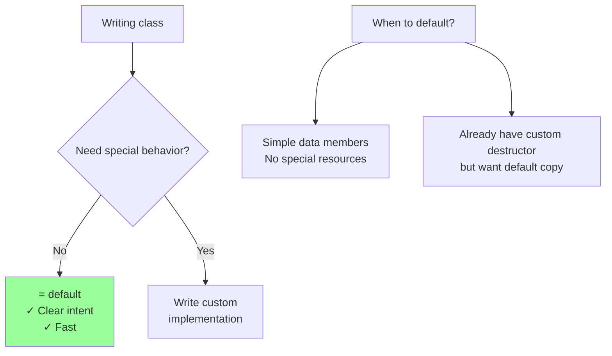
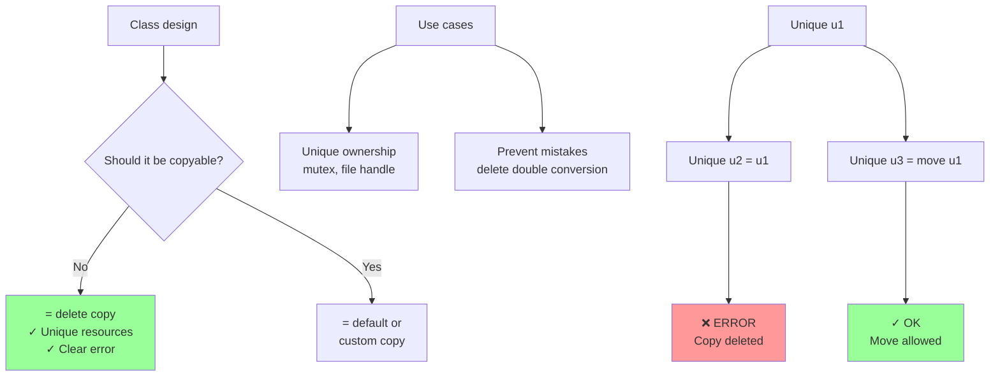
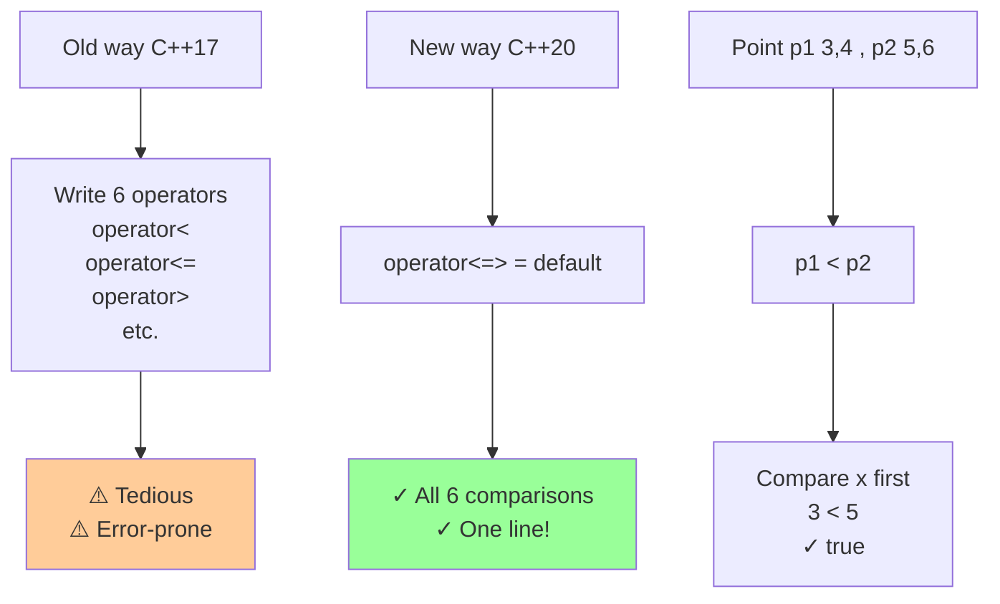

# Special member function control

## Special member function control

### [Explicitly-defaulted functions](https://en.cppreference.com/w/cpp/language/function.html#Explicitly-defaulted_functions) (C++11)

**Code-related Keywords:**
- `Function() = default;` - Request compiler-generated version (C++11)
- Default special members - Constructor, copy/move, destructor

**Theory Keywords:**
- **explicit intent** - Tell compiler clearly "I want the default version"
- **optimization** - Compiler-generated defaults are often faster than hand-written



**Example:**
```cpp
class Point {
    int x, y;
    
public:
    Point() = default;        // C++11: use default constructor
    Point(int a, int b) : x(a), y(b) {}
    
    // Explicitly default copy/move:
    Point(const Point&) = default;
    Point(Point&&) = default;
    Point& operator=(const Point&) = default;
    Point& operator=(Point&&) = default;
    ~Point() = default;
};

// When custom destructor needed, default others:
class Resource {
    FILE* file;
    
public:
    Resource(const char* path) : file(fopen(path, "r")) {}
    ~Resource() { if (file) fclose(file); }  // Custom destructor
    
    // Still want default copy:
    Resource(const Resource&) = default;
    Resource& operator=(const Resource&) = default;
};
```

### [Deleted functions](https://en.cppreference.com/w/cpp/language/function.html#Deleted_functions) (C++11)

**Code-related Keywords:**
- `Function() = delete;` - Disable [function](../../07_functions/functions.md) (C++11)
- Prevent copying/moving - Common use
- Delete overloads - Prevent implicit [conversions](../../04_expressions/conversions.md)

**Theory Keywords:**
- **explicit disabling** - Make function unusable (compiler error if anyone tries)
- **overload resolution** - Deleted function still shows up (so compiler can give good error message)
- **non-copyable** - Common pattern: delete copy constructor and copy assignment



**Example:**
```cpp
// Non-copyable class:
class Unique {
public:
    Unique() = default;
    
    // Delete copy operations:
    Unique(const Unique&) = delete;
    Unique& operator=(const Unique&) = delete;
    
    // Allow move:
    Unique(Unique&&) = default;
    Unique& operator=(Unique&&) = default;
};

Unique u1;
// Unique u2 = u1;        // ERROR: copy deleted
Unique u3 = std::move(u1);  // OK: move allowed

// Prevent implicit conversions:
class Integer {
    int value;
    
public:
    Integer(int v) : value(v) {}
    
    // Delete double conversion:
    Integer(double) = delete;  // Prevent Integer i = 3.14;
};

Integer i1(42);           // OK
// Integer i2 = 3.14;     // ERROR: deleted
```

### [Default comparisons](https://en.cppreference.com/w/cpp/language/default_comparisons.html) (C++20)

**Code-related Keywords:**
- `auto operator<=>(const T&) = default;` - Spaceship [operator](../../04_expressions/operators.md) (C++20)
- `bool operator==(const T&) = default;` - Default equality (C++20)
- Three-way comparison - Returns `<=>` result

**Theory Keywords:**
- **spaceship operator** - Write one operator, get all 6 comparisons (<, <=, >, >=, ==, !=) for free!
- **lexicographical** - Compare members in order (first member first, then second, etc.)
- **strong/weak ordering** - How comparison works (strong = exact order, weak = equivalent items)



**Example:**
```cpp
#include <compare>

// C++20 default comparisons:
class Point {
    int x, y;
    
public:
    Point(int a, int b) : x(a), y(b) {}
    
    // Spaceship: generates <, <=, >, >=, ==, !=
    auto operator<=>(const Point&) const = default;
};

Point p1(1, 2), p2(3, 4);
bool b1 = p1 < p2;        // true (compares x first, then y)
bool b2 = p1 == p2;       // false
bool b3 = p1 != p2;       // true

// Custom spaceship with auto:
class String {
    std::string data;
    
public:
    auto operator<=>(const String& other) const {
        return data <=> other.data;  // Delegate to std::string
    }
    
    bool operator==(const String& other) const = default;
};

// Comparison categories:
struct Temperature {
    double celsius;
    
    std::partial_ordering operator<=>(const Temperature& other) const {
        if (std::isnan(celsius) || std::isnan(other.celsius))
            return std::partial_ordering::unordered;  // NaN handling
        if (celsius < other.celsius) return std::partial_ordering::less;
        if (celsius > other.celsius) return std::partial_ordering::greater;
        return std::partial_ordering::equivalent;
    }
};
```
