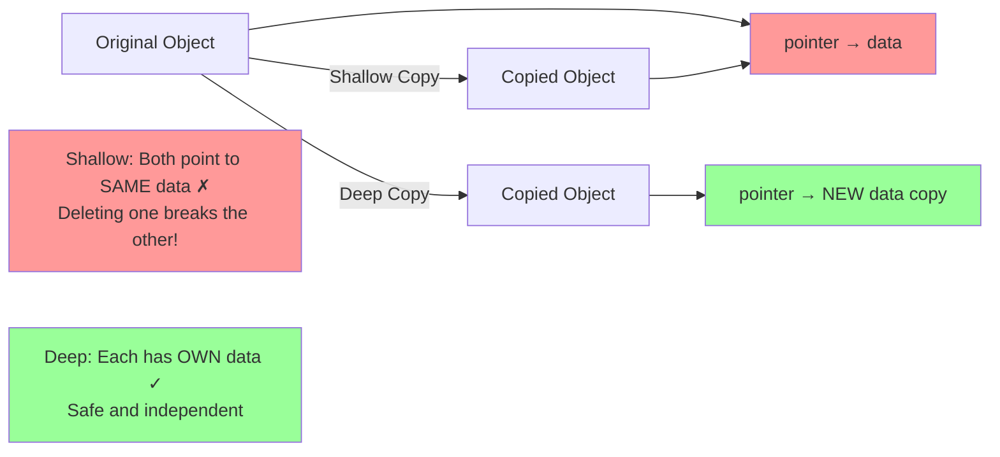
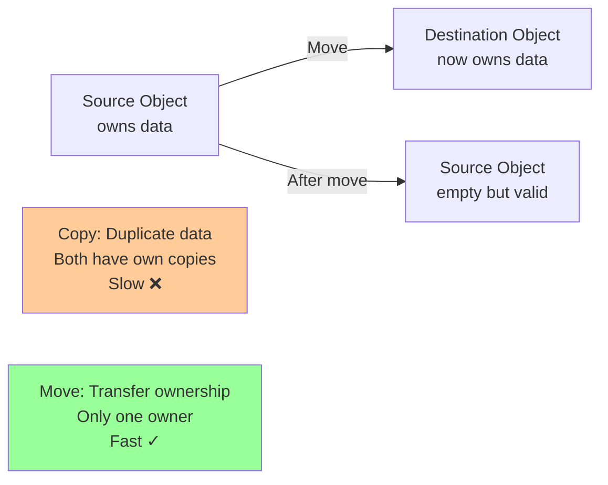

# Special member functions

## Special member functions

### [Default constructor](https://en.cppreference.com/w/cpp/language/default_constructor.html)

**Code-related Keywords:**
- `ClassName()` - No parameters
- Compiler-generated - If no constructor defined
- `= default` (C++11) - Explicitly request default

**Theory Keywords:**
- **automatic generation** - Compiler creates if needed
- **default [initialization](../../06_initialization/initialization.md)** - Members default-initialized

**Example:**
```cpp
class Point {
    int x, y;
    
public:
    Point() : x(0), y(0) {}   // Default constructor
    Point(int a, int b) : x(a), y(b) {}
};

Point p1;                 // Calls default: (0, 0)
Point p2(3, 4);           // Calls parameterized: (3, 4)

// Compiler-generated:
struct Simple {           // No constructor defined
    int value;
};
Simple s;                 // Default constructor (value uninitialized)

// Explicitly defaulted:
class Foo {
public:
    Foo() = default;      // C++11: use compiler-generated default
    Foo(int x) { }        // Custom constructor
};
```

### [Copy constructor](https://en.cppreference.com/w/cpp/language/copy_constructor.html)

**Code-related Keywords:**
- `ClassName(const ClassName& other)` - Copy constructor
- `= delete` (C++11) - Disable copying
- Deep copy - Allocate new resources

**Theory Keywords:**
- **shallow copy** - Default: just copies all member values directly (dangerous with pointers!)
- **deep copy** - Manually copy what pointers point to (safe, makes independent copies)
- **rule of three** - If you need custom destructor/copy, you need all three



**Example:**
```cpp
class String {
    char* data;
    size_t size;
    
public:
    String(const char* s) {
        size = strlen(s);
        data = new char[size + 1];
        strcpy(data, s);
    }
    
    // Copy constructor (deep copy):
    String(const String& other) {
        size = other.size;
        data = new char[size + 1];
        strcpy(data, other.data);  // Copy data, not pointer
    }
    
    ~String() { delete[] data; }
};

String s1("hello");
String s2 = s1;           // Copy: s2 has own copy of "hello"
String s3(s1);            // Also copy

// Disable copying:
class Unique {
public:
    Unique(const Unique&) = delete;  // C++11: no copying
};
```

### [Move constructor](https://en.cppreference.com/w/cpp/language/move_constructor.html) (C++11)

**Code-related Keywords:**
- `ClassName(ClassName&& other)` - Move constructor (C++11)
- `std::move()` - Cast to rvalue
- `noexcept` - No [exceptions](../../11_exceptions/exceptions.md) (important for optimization)

**Theory Keywords:**
- **transfer ownership** - Take resources from source object, leave it empty (efficient!)
- **rvalue [reference](../../05_declarations/compound_types.md)** - Special reference (`&&`) that binds to temporary objects
- **rule of five** - If you define move operations, define all five special member functions



**Example:**
```cpp
class Buffer {
    int* data;
    size_t size;
    
public:
    Buffer(size_t s) : size(s), data(new int[s]) {}
    
    // Move constructor:
    Buffer(Buffer&& other) noexcept {
        data = other.data;        // Steal pointer
        size = other.size;
        other.data = nullptr;     // Leave source empty
        other.size = 0;
    }
    
    ~Buffer() { delete[] data; }
};

Buffer b1(100);           // Create buffer
Buffer b2 = std::move(b1);  // Move: b2 steals data, b1 becomes empty
// b1 is now valid but empty (data == nullptr)
```

### [Copy assignment operator](https://en.cppreference.com/w/cpp/language/copy_assignment.html)

**Code-related Keywords:**
- `ClassName& operator=(const ClassName& other)` - Copy assignment
- Return `*this` - Enable chaining
- Self-assignment check - `if (this != &other)`

**Theory Keywords:**
- **copy-and-swap** - Exception-safe idiom
- **resource cleanup** - Delete old resources before copy

**Example:**
```cpp
class String {
    char* data;
    
public:
    // Copy assignment:
    String& operator=(const String& other) {
        if (this != &other) {     // Self-assignment check
            delete[] data;        // Free old resource
            
            data = new char[strlen(other.data) + 1];
            strcpy(data, other.data);  // Deep copy
        }
        return *this;         // Enable chaining
    }
};

String s1("hello"), s2("world");
s1 = s2;                  // Copy: s1 = "world"
s1 = s1;                  // Self-assignment (safe due to check)
```

### [Move assignment operator](https://en.cppreference.com/w/cpp/language/move_assignment.html) (C++11)

**Code-related Keywords:**
- `ClassName& operator=(ClassName&& other)` - Move assignment (C++11)
- `noexcept` - No exceptions

**Theory Keywords:**
- **transfer and cleanup** - Steal resources, clean up old
- **self-move** - Check for self-assignment

**Example:**
```cpp
class Buffer {
    int* data;
    size_t size;
    
public:
    // Move assignment:
    Buffer& operator=(Buffer&& other) noexcept {
        if (this != &other) {     // Self-move check
            delete[] data;        // Free old resource
            
            data = other.data;    // Steal
            size = other.size;
            other.data = nullptr; // Leave source empty
            other.size = 0;
        }
        return *this;
    }
};

Buffer b1(100), b2(200);
b1 = std::move(b2);       // Move: b1 steals b2's data
// b2 is now empty
```

### [Destructor](https://en.cppreference.com/w/cpp/language/destructor.html)

**Code-related Keywords:**
- `~ClassName()` - Destructor
- `virtual ~ClassName()` - Virtual destructor (for polymorphism)
- RAII - Resource Acquisition Is Initialization

**Theory Keywords:**
- **cleanup** - Free resources, release locks
- **automatic invocation** - Called when [object](../../02_types_and_objects/object.md) goes out of scope
- **virtual required** - For base classes with derived types

**Example:**
```cpp
class File {
    FILE* handle;
    
public:
    File(const char* path) {
        handle = fopen(path, "r");
    }
    
    ~File() {                 // Destructor: cleanup
        if (handle) {
            fclose(handle);   // Release resource
        }
    }
};

{
    File f("data.txt");       // Constructor opens file
    // Use file
}                             // Destructor automatically closes file

// Virtual destructor for inheritance:
class Base {
public:
    virtual ~Base() {}        // Virtual: ensures derived destructor called
};

class Derived : public Base {
    int* data;
public:
    Derived() : data(new int[100]) {}
    ~Derived() { delete[] data; }  // Cleanup derived resources
};

Base* p = new Derived;
delete p;                     // Calls ~Derived then ~Base (due to virtual)
```
