# Dependent names

## Dependent names

### [Dependent names](https://en.cppreference.com/w/cpp/language/dependent_name.html)

**Code-related Keywords:**
- `typename T::type` - Dependent type name
- `template T::func<>()` - Dependent template name
- `.template` - Disambiguate template member

**Theory Keywords:**
- **dependent name** - A name whose meaning depends on what type T actually is
- **two-phase lookup** - Compiler checks template twice: once when defined, once when used
- **disambiguation** - Use `typename` or `template` keywords to help compiler understand your intent


**Example:**
```cpp
// Dependent type (needs typename):
template<typename T>
void process() {
    typename T::value_type val;  // typename: T::value_type is a type
    // T::value_type val;        // ERROR: could be a value
}

std::vector<int> v;
// process<decltype(v)>();       // T::value_type = int

// Dependent template member:
template<typename T>
void call() {
    T obj;
    obj.template func<int>();    // template: func is a template
    // obj.func<int>();          // ERROR: < treated as less-than
}

// Real-world example:
template<typename Container>
void print(const Container& c) {
    typename Container::const_iterator it = c.begin();  // typename required
    
    for (; it != c.end(); ++it) {
        std::cout << *it << ' ';
    }
}

// Dependent base class:
template<typename T>
class Base {
public:
    void baseFunc() { }
};

template<typename T>
class Derived : public Base<T> {
public:
    void derivedFunc() {
        this->baseFunc();        // this-> makes name dependent
        // baseFunc();           // ERROR: non-dependent lookup fails
        Base<T>::baseFunc();     // Alternative: qualified name
    }
};
```

### [SFINAE](https://en.cppreference.com/w/cpp/language/sfinae.html)

**Code-related Keywords:**
- SFINAE - Substitution Failure Is Not An Error
- `std::enable_if` - Conditional enablement
- `std::void_t` (C++17) - Detect valid [expressions](../../04_expressions/expressions.md)
- Overload resolution - SFINAE participates

**Theory Keywords:**
- **substitution failure** - When compiler tries a template with a type and it doesn't work
- **template metaprogramming** - Using templates to make decisions at compile time
- **concepts alternative** - C++20 concepts are the modern, cleaner way to do what SFINAE did

```mermaid
graph TD
    A[Template Function] --> B{Try to substitute<br/>type T}
    B -->|Works| C[Keep this function<br/>in overload set ✓]
    B -->|Fails| D[Remove quietly<br/>Not an error!]
    D --> E[SFINAE:<br/>Substitution Failure<br/>Is Not An Error]
    
    C --> F[Compiler picks<br/>best match]
    
    style C fill:#99ff99
    style D fill:#ffcc99
```



**Example:**
```cpp
#include <type_traits>

// SFINAE with enable_if:
template<typename T>
typename std::enable_if<std::is_integral<T>::value, T>::type
square(T value) {
    return value * value;    // Only for integral types
}

template<typename T>
typename std::enable_if<std::is_floating_point<T>::value, T>::type
square(T value) {
    return value * value;    // Only for floating-point types
}

auto x = square(5);          // Calls integral version
auto y = square(3.14);       // Calls floating-point version

// Modern SFINAE with std::enable_if_t (C++14):
template<typename T, typename = std::enable_if_t<std::is_integral_v<T>>>
T increment(T value) {
    return value + 1;
}

// Detection idiom with std::void_t (C++17):
template<typename, typename = void>
struct has_value_type : std::false_type {};

template<typename T>
struct has_value_type<T, std::void_t<typename T::value_type>> 
    : std::true_type {};

static_assert(has_value_type<std::vector<int>>::value);  // true
static_assert(!has_value_type<int>::value);              // true

// Function overloading with SFINAE:
template<typename T>
auto getValue(T t) -> decltype(t.value()) {  // Only if t.value() valid
    return t.value();
}

template<typename T>
auto getValue(T t) -> decltype(t) {          // Fallback
    return t;
}

// C++20 concepts (cleaner alternative):
template<typename T>
concept HasValue = requires(T t) { t.value(); };

template<HasValue T>
auto getValueConcept(T t) {
    return t.value();
}

template<typename T>
auto getValueConcept(T t) {
    return t;
}
```
