# Template argument deduction

## Template argument deduction

### [Function template argument deduction](https://en.cppreference.com/w/cpp/language/template_argument_deduction.html)

**Code-related Keywords:**
- Automatic deduction - Infer template parameters from arguments
- `auto` - Type deduction
- `decltype(auto)` (C++14) - Perfect forwarding
- Forwarding [reference](../../05_declarations/compound_types.md) - `T&&`

**Theory Keywords:**
- **deduction rules** - Compiler figures out template types from what you pass
- **perfect forwarding** - Pass arguments exactly as they were received (keep lvalue as lvalue, rvalue as rvalue)
- **template argument deduction** - Look at function call arguments to figure out template types

```mermaid
graph TD
    A[Call: print 42 ] --> B{What type is 42?}
    B --> C[int]
    C --> D[✓ T = int]
    
    E[Call: forward x ] --> F{Is x lvalue or rvalue?}
    F -->|lvalue| G[T = int&<br/>Keep lvalue]
    F -->|rvalue| H[T = int<br/>Keep rvalue]
    
    I[Perfect forwarding<br/>T&&] --> J[Preserves whether<br/>argument is lvalue/rvalue]
    
    style D fill:#99ff99
    style G fill:#99ff99
    style H fill:#99ff99
```



**Example:**
```cpp
// Basic deduction:
template<typename T>
void print(T value) {
    std::cout << value << '\n';
}

print(42);                // Deduced: T = int
print(3.14);              // Deduced: T = double
print("hello");           // Deduced: T = const char*

// Reference deduction:
template<typename T>
void modify(T& value) {   // Lvalue reference
    value *= 2;
}

int x = 10;
modify(x);                // T = int, parameter is int&
std::cout << x;           // 20

// Forwarding reference (universal reference):
template<typename T>
void forward(T&& value) { // T&& is forwarding reference
    process(std::forward<T>(value));  // Perfect forwarding
}

int a = 5;
forward(a);               // Lvalue: T = int&, parameter int& &&  = int&
forward(10);              // Rvalue: T = int, parameter int&&

// Deduction with multiple parameters:
template<typename T>
T max(T a, T b) {
    return a > b ? a : b;
}

auto m1 = max(3, 5);      // OK: both int
// auto m2 = max(3, 5.5); // ERROR: conflicting deduction (int vs double)

// Explicit argument bypasses deduction:
auto m3 = max<double>(3, 5.5);  // OK: T = double explicitly
```

### [Class template argument deduction (CTAD)](https://en.cppreference.com/w/cpp/language/ctad.html) (C++17)

**Code-related Keywords:**
- `ClassName obj(args);` - Deduce template arguments (C++17)
- Deduction guides - Custom deduction rules
- `std::pair`, `std::tuple` - Common uses

**Theory Keywords:**
- **implicit instantiation** - Omit angle brackets
- **deduction guide** - Hint to compiler for deduction
- **convenience** - Less verbose code

**Example:**
```cpp
// C++17 CTAD:
std::pair p(42, 3.14);    // Deduced: std::pair<int, double>
std::tuple t(1, 2.0, "hi");  // std::tuple<int, double, const char*>
std::vector v{1, 2, 3};   // std::vector<int>

// Custom class with CTAD:
template<typename T>
class Wrapper {
    T value;
    
public:
    Wrapper(T v) : value(v) {}
    T get() const { return value; }
};

Wrapper w(42);            // C++17: Deduced Wrapper<int>
// Before C++17: Wrapper<int> w(42);

// Deduction guide:
template<typename T>
class Container {
    T* data;
    size_t size;
    
public:
    Container(T* d, size_t s) : data(d), size(s) {}
};

// Deduction guide:
template<typename T>
Container(T*, size_t) -> Container<T>;  // Guide compiler

int arr[] = {1, 2, 3};
Container c(arr, 3);      // Deduced: Container<int>

// Complex example:
std::lock_guard lock(mutex);  // Deduced: std::lock_guard<std::mutex>
// Before C++17: std::lock_guard<std::mutex> lock(mutex);
```
