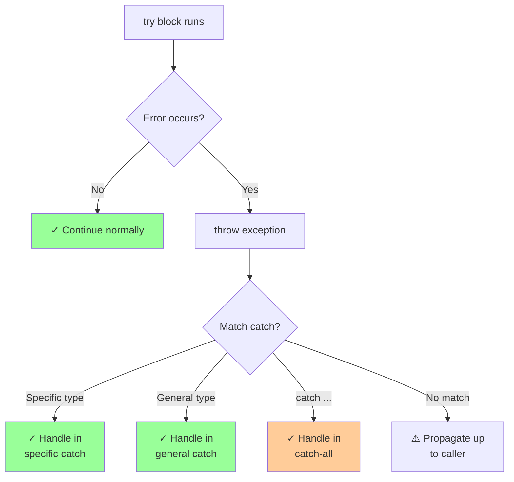

# Exception handling

## Exception handling

### [try block](https://en.cppreference.com/w/cpp/language/try.html)

**Code-related Keywords:**
- `try { }` - Protected code block
- `catch (Type e) { }` - Exception handler
- `catch (...)` - Catch all exceptions
- Function-try-block - `Constructor() try { } catch { }`

**Theory Keywords:**
- **exception propagation** - Exception travels up the call stack until something catches it
- **multiple catch** - Try different exception types (like different error cases)
- **catch order** - Put specific catches first, general ones last (like if-else)



**Example:**
```cpp
// Basic try-catch:
try {
    int x = 10 / 0;       // May throw
} catch (const std::exception& e) {
    std::cout << "Error: " << e.what() << '\n';
}

// Multiple catch blocks:
try {
    std::vector<int> v;
    v.at(100);            // Throws out_of_range
} catch (const std::out_of_range& e) {
    std::cout << "Out of range: " << e.what() << '\n';
} catch (const std::exception& e) {  // More general
    std::cout << "Exception: " << e.what() << '\n';
} catch (...) {           // Catch all
    std::cout << "Unknown exception\n";
}

// Function-try-block (for constructors):
class Resource {
    File file;
    
public:
    Resource(const char* path)
    try : file(path) {    // Try-block for initializer list
        // Constructor body
    } catch (const std::exception& e) {
        std::cout << "Failed to open: " << e.what() << '\n';
        throw;            // Re-throw
    }
};

// Nested try-catch:
try {
    try {
        throw std::runtime_error("Inner");
    } catch (const std::logic_error& e) {  // Doesn't match
        // Not caught here
    }
    // Exception propagates to outer catch
} catch (const std::runtime_error& e) {
    std::cout << "Outer caught: " << e.what() << '\n';
}
```

### [Throwing exceptions](https://en.cppreference.com/w/cpp/language/throw.html)

**Code-related Keywords:**
- `throw expr;` - Throw exception
- `throw;` - Re-throw current exception
- `std::throw_with_nested` - Wrap exceptions

**Theory Keywords:**
- **exception [object](../../02_types_and_objects/object.md)** - Thrown value (usually derived from std::exception)
- **re-throw** - Pass exception to outer handler
- **exception chaining** - Nested exceptions

**Example:**
```cpp
#include <stdexcept>

// Throw exception:
void validateInput(int x) {
    if (x < 0) {
        throw std::invalid_argument("Negative value");
    }
}

// Re-throw:
try {
    validateInput(-5);
} catch (const std::exception& e) {
    std::cout << "Caught: " << e.what() << '\n';
    throw;                // Re-throw to caller
}

// Custom exception:
class MyException : public std::exception {
    std::string msg;
    
public:
    MyException(const std::string& m) : msg(m) {}
    const char* what() const noexcept override {
        return msg.c_str();
    }
};

throw MyException("Custom error");

// Throw by value, catch by const reference:
try {
    throw std::runtime_error("Error");  // Throw by value
} catch (const std::exception& e) {    // Catch by reference (avoid slicing)
    std::cout << e.what() << '\n';
}
```

### [Handling exceptions](https://en.cppreference.com/w/cpp/language/catch.html)

**Code-related Keywords:**
- `catch (Type e)` - Catch by value (avoid)
- `catch (const Type& e)` - Catch by const [reference](../../05_declarations/compound_types.md) (preferred)
- `catch (...)` - Catch all
- `std::current_exception()` - Capture exception

**Theory Keywords:**
- **catch by reference** - Avoid slicing, more efficient
- **polymorphic catch** - Base class reference catches derived
- **exception slicing** - Loss of derived information if caught by value

**Example:**
```cpp
// Catch by const reference (best practice):
try {
    throw std::runtime_error("Error");
} catch (const std::exception& e) {  // Const reference
    std::cout << e.what() << '\n';
}

// Polymorphic catching:
class BaseException : public std::exception { };
class DerivedException : public BaseException { };

try {
    throw DerivedException();
} catch (const BaseException& e) {   // Catches derived too
    // Handles DerivedException
}

// Catch all:
try {
    throw 42;             // Can throw any type
} catch (...) {           // Catches everything
    std::cout << "Unknown exception\n";
    throw;                // Can re-throw
}

// std::current_exception (store exception):
std::exception_ptr eptr;

try {
    throw std::runtime_error("Error");
} catch (...) {
    eptr = std::current_exception();  // Capture exception
}

// Rethrow later:
if (eptr) {
    try {
        std::rethrow_exception(eptr);
    } catch (const std::exception& e) {
        std::cout << "Rethrown: " << e.what() << '\n';
    }
}
```
