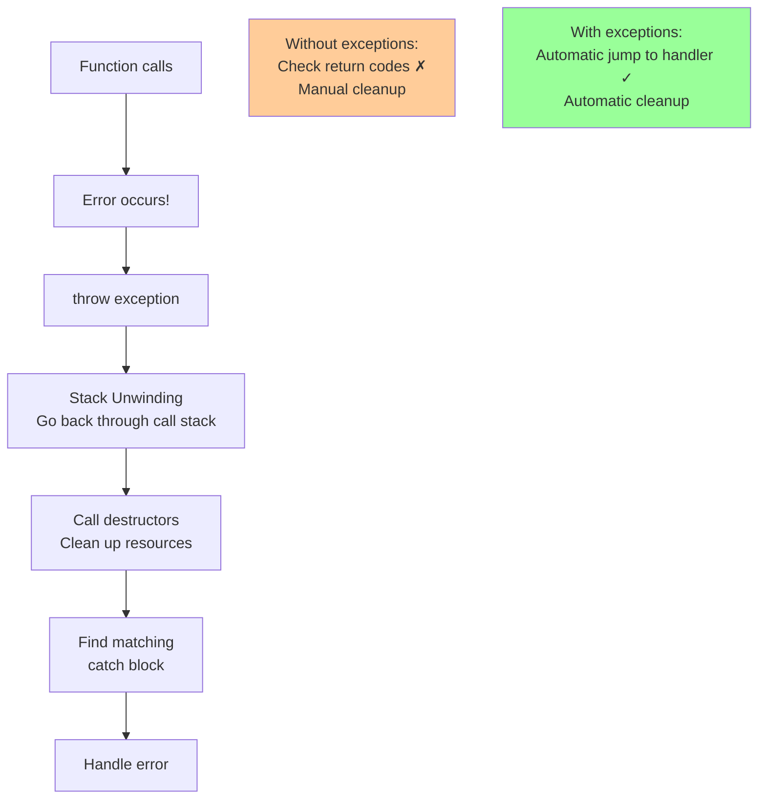

# Exceptions

## [Exceptions](https://en.cppreference.com/w/cpp/language/exceptions.html)

**Code-related Keywords:**
- `throw exception;` - Throw exception
- `try { } catch (Type e) { }` - Handle exceptions
- `std::exception` - Standard exception base [class](../../09_classes/classes.md)
- `noexcept` - No exceptions thrown

**Theory Keywords:**
- **error handling** - Way to handle errors (alternative to checking return codes everywhere)
- **stack unwinding** - When exception is thrown, automatically calls destructors as it exits scopes
- **RAII** - Resources get cleaned up automatically via destructors (files close, memory freed, etc.)
- **exception safety** - Guarantees about what state your program is in after an exception



**Example:**
```cpp
#include <stdexcept>

// Throwing exceptions:
void checkAge(int age) {
    if (age < 0) {
        throw std::invalid_argument("Age cannot be negative");
    }
    if (age > 150) {
        throw std::out_of_range("Age too large");
    }
}

// Catching exceptions:
try {
    checkAge(-5);         // Throws invalid_argument
} catch (const std::invalid_argument& e) {
    std::cout << "Error: " << e.what() << '\n';
} catch (const std::exception& e) {  // Catch all std::exception
    std::cout << "Exception: " << e.what() << '\n';
}

// Stack unwinding (RAII cleanup):
void process() {
    std::vector<int> v = {1, 2, 3};  // Destructor called if exception
    File f("data.txt");   // Destructor closes file if exception
    
    throw std::runtime_error("Error");  // Stack unwinds, destructors run
}

try {
    process();
} catch (const std::exception& e) {
    // v and f already cleaned up
}

// noexcept functions:
int safeFunc() noexcept {  // Guarantees no exceptions
    return 42;
}
```
