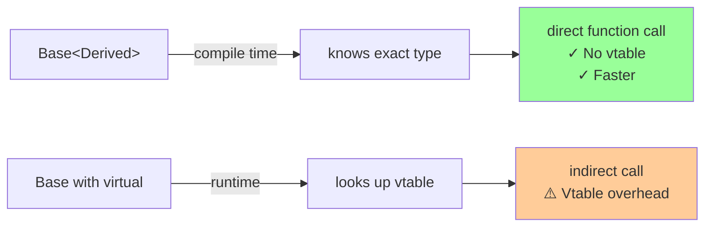
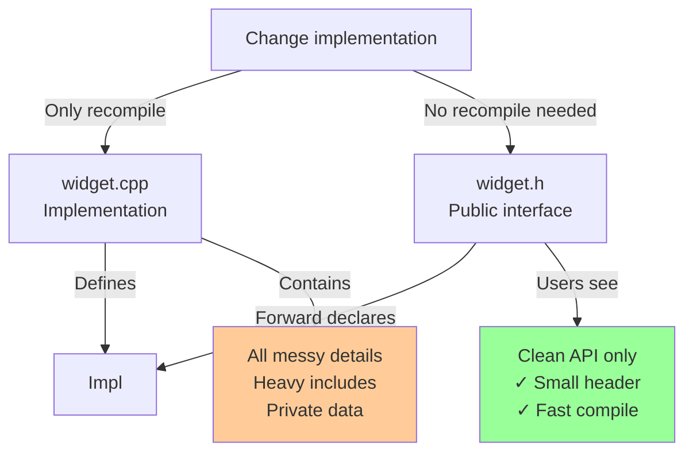

# Idioms

## Idioms

### [Curiously Recurring Template Pattern (CRTP)](https://en.cppreference.com/w/cpp/language/crtp.html)

**Code-related Keywords:**
- Base [template](../../10_templates/templates.md) with derived as parameter - `template<typename Derived> class Base`
- Static polymorphism - Compile-time dispatch

**Theory Keywords:**
- **static polymorphism** - Different behavior for different types without virtual functions (faster!)
- **code reuse** - Write shared logic once in base class
- **zero overhead** - No vtable or runtime cost (all resolved at compile time)



**Example:**
```cpp
// CRTP base class:
template<typename Derived>
class Shape {
public:
    double area() const {
        return static_cast<const Derived*>(this)->areaImpl();
    }
    
    void draw() const {
        std::cout << "Area: " << area() << '\n';
    }
};

// Derived classes:
class Circle : public Shape<Circle> {
    double radius;
    
public:
    Circle(double r) : radius(r) {}
    
    double areaImpl() const {  // Called by base
        return 3.14159 * radius * radius;
    }
};

class Square : public Shape<Square> {
    double side;
    
public:
    Square(double s) : side(s) {}
    
    double areaImpl() const {
        return side * side;
    }
};

Circle c(5.0);
c.draw();                 // "Area: 78.5398" (no virtual call)

Square s(4.0);
s.draw();                 // "Area: 16" (compile-time dispatch)
```

### [Pointer to implementation (PIMPL)](https://en.cppreference.com/w/cpp/language/pimpl.html)

**Code-related Keywords:**
- Forward [declaration](../../05_declarations/declarations.md) - Hide implementation class
- `std::unique_ptr<Impl>` - [Pointer](../../05_declarations/compound_types.md) to implementation
- Compilation firewall - Changes don't require recompilation

**Theory Keywords:**
- **implementation hiding** - Keep all the messy details hidden in .cpp file
- **binary compatibility** - Change how it works inside without breaking code that uses it (change .cpp without changing .h)
- **reduce dependencies** - Your header doesn't need to include heavy headers (faster compilation for users)



**Example:**
```cpp
// widget.h (public interface):
class Widget {
    struct Impl;          // Forward declaration
    std::unique_ptr<Impl> pImpl;  // Pointer to implementation
    
public:
    Widget();
    ~Widget();            // Must define in .cpp (for unique_ptr<Impl>)
    
    void doSomething();
    int getValue() const;
};

// widget.cpp (implementation):
struct Widget::Impl {     // Hidden from users
    int value;
    std::vector<double> data;  // Heavy includes hidden
    
    void complexOperation() { /* ... */ }
};

Widget::Widget() : pImpl(std::make_unique<Impl>()) {}
Widget::~Widget() = default;  // unique_ptr needs complete type

void Widget::doSomething() {
    pImpl->complexOperation();  // Delegate to impl
}

int Widget::getValue() const {
    return pImpl->value;
}

// Users only see widget.h, not implementation details
```

### [Resource acquisition is initialization (RAII)](https://en.cppreference.com/w/cpp/language/raii.html)

**Code-related Keywords:**
- Constructor acquires - Resource in constructor
- Destructor releases - Cleanup in destructor
- `std::unique_ptr`, `std::lock_guard` - RAII wrappers

**Theory Keywords:**
- **automatic cleanup** - Destructor always called
- **[exception](../../11_exceptions/exceptions.md) safety** - Resources released even if exception
- **deterministic** - Cleanup at scope exit

**Example:**
```cpp
// RAII file wrapper:
class File {
    FILE* handle;
    
public:
    File(const char* path) : handle(fopen(path, "r")) {
        if (!handle) throw std::runtime_error("Failed to open");
    }
    
    ~File() {             // Automatic cleanup
        if (handle) fclose(handle);
    }
    
    // Delete copy, allow move:
    File(const File&) = delete;
    File& operator=(const File&) = delete;
    File(File&& other) noexcept : handle(other.handle) {
        other.handle = nullptr;
    }
    
    FILE* get() const { return handle; }
};

void process() {
    File f("data.txt");   // Acquires resource
    // Use file...
    // throw std::exception();  // Even if exception, ~File() called
}   // File closed automatically

// Standard RAII types:
{
    std::unique_ptr<int> p(new int(42));  // Acquires memory
    std::lock_guard<std::mutex> lock(mtx);  // Acquires lock
    std::vector<int> v = {1, 2, 3};       // Acquires memory
}   // All released automatically
```

### [Rule of three/five/zero](https://en.cppreference.com/w/cpp/language/rule_of_three.html)

**Code-related Keywords:**
- Rule of three - Destructor, copy constructor, copy assignment
- Rule of five - Add move constructor, move assignment (C++11)
- Rule of zero - Use default or standard [types](../../02_types_and_objects/types.md)

**Theory Keywords:**
- **resource management** - If custom destructor, need custom copy/move
- **rule of zero** - Prefer no custom special members
- **default** - Use `= default` or standard types

**Example:**
```cpp
// Rule of three (C++98):
class String {
    char* data;
    
public:
    // 1. Destructor
    ~String() { delete[] data; }
    
    // 2. Copy constructor
    String(const String& other) {
        data = new char[strlen(other.data) + 1];
        strcpy(data, other.data);
    }
    
    // 3. Copy assignment
    String& operator=(const String& other) {
        if (this != &other) {
            delete[] data;
            data = new char[strlen(other.data) + 1];
            strcpy(data, other.data);
        }
        return *this;
    }
};

// Rule of five (C++11):
class Buffer {
    int* data;
    
public:
    ~Buffer() { delete[] data; }  // 1. Destructor
    
    Buffer(const Buffer&);        // 2. Copy constructor
    Buffer& operator=(const Buffer&);  // 3. Copy assignment
    
    Buffer(Buffer&& other) noexcept {  // 4. Move constructor
        data = other.data;
        other.data = nullptr;
    }
    
    Buffer& operator=(Buffer&& other) noexcept {  // 5. Move assignment
        if (this != &other) {
            delete[] data;
            data = other.data;
            other.data = nullptr;
        }
        return *this;
    }
};

// Rule of zero (preferred):
class Modern {
    std::vector<int> data;  // Handles all special members
    std::string name;       // No custom destructor/copy/move needed
    // Compiler generates all special members correctly
};
```

### [Zero-overhead principle](https://en.cppreference.com/w/cpp/language/Zero-overhead_principle.html)

**Theory Keywords:**
- **no abstraction cost** - High-level code as fast as low-level
- **pay for what you use** - No cost if feature not used
- **compile-time** - Optimization at compile time

**Example:**
```cpp
// Abstraction with zero overhead:
template<typename T>
T max(T a, T b) {
    return a > b ? a : b;  // Inlined to single comparison
}

int x = max(3, 5);        // Compiles to: mov eax, 5 (no function call)

// Range-based for (same as manual loop):
std::vector<int> v = {1, 2, 3, 4, 5};

for (auto x : v) {        // Zero overhead vs manual iterator loop
    std::cout << x;
}

// Equivalent low-level code:
for (auto it = v.begin(); it != v.end(); ++it) {
    std::cout << *it;
}

// RAII with zero overhead:
{
    std::unique_ptr<int> p(new int(42));  // No overhead vs raw pointer
}   // Destructor inlined, same as delete

// Examples that DON'T follow zero-overhead:
// - virtual functions (vtable overhead)
// - exceptions (some overhead even if not thrown)
// - RTTI (runtime type information overhead)
```
